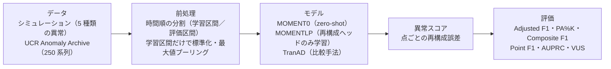
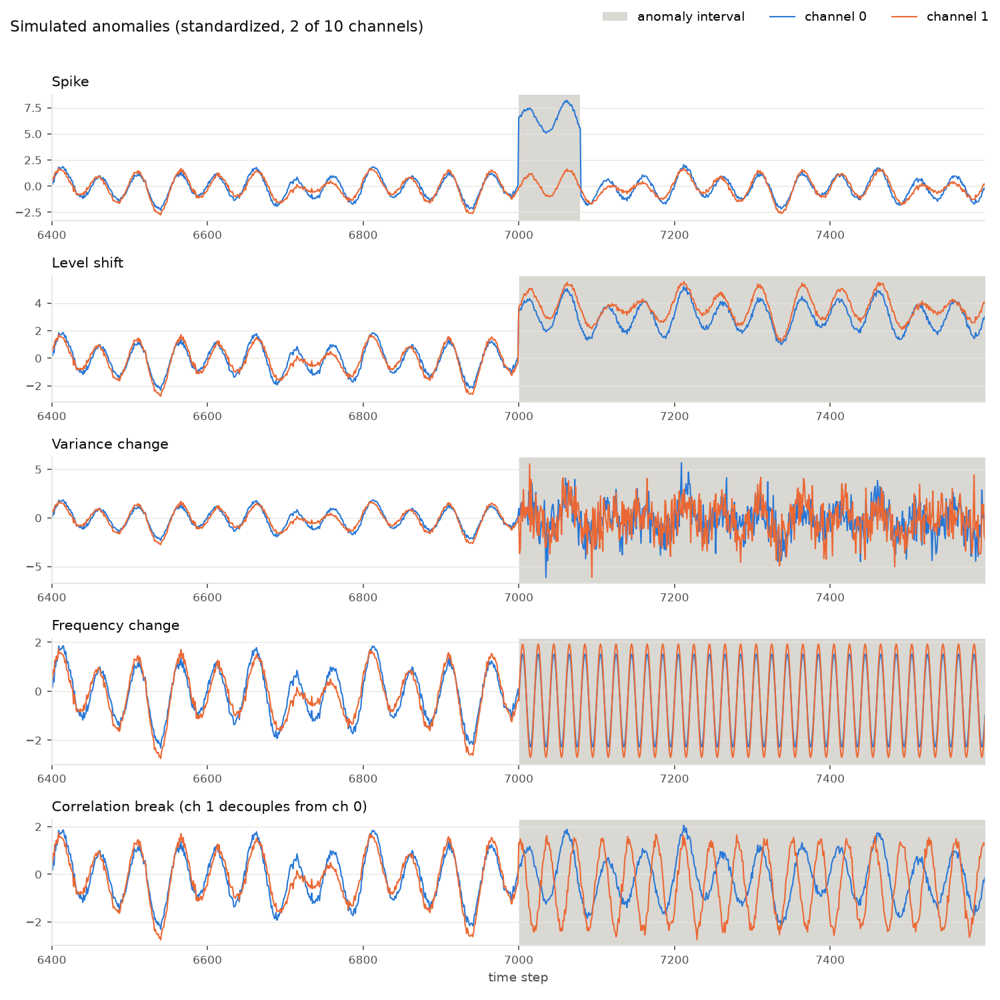

# tsfm-anomaly-eval

[](https://github.com/claireyu1229/tsfm-anomaly-eval/actions/workflows/ci.yml)

[](LICENSE)

## 概要

時系列基盤モデル **MOMENT** を異常検知に使ったとき、**どんな異常に強く、どんな異常に弱いのか**を調べるための評価コードです。
5 種類の異常を入れたシミュレーションデータと、UCR Anomaly Archive の 250 データを、**同じ前処理・同じ指標**で評価します。
現在は MOMENT の zero-shot と linear probing、比較用の TranAD を実装済みで、結果は実験・分析中です。

### このリポジトリの見どころ

- **全モデル共通の評価手順**：MOMENT も TranAD も、同じ読み込み・分割・指標のコードを通ります（[`scripts/run_ucr_benchmark.py`](scripts/run_ucr_benchmark.py)、[`configs/`](configs/)）。
- **データリーク対策をテストで確認**：時間順の分割と、学習区間だけでのスケーリングを検証しています（[`tests/test_preprocess.py`](tests/test_preprocess.py)）。
- **指標の実装を素朴な実装と突き合わせ**：高速化したしきい値探索が、1 つずつ調べるループと完全に同じ値になることを確かめています（[`tests/test_metrics.py`](tests/test_metrics.py)）。
- **GPU なしで試せるデモと CI**：CPU だけで数十秒で動き、push のたびに ruff と pytest が自動で走ります。

## 背景と目的

設備やサーバーの監視では、故障そのものより「故障の前に起きる小さな変化」を早く見つけたい場面が多くあります。ただ、変化の形はさまざまです。一瞬の跳ね、水準のずれ、ばらつきの増加、周期の変化、センサー同士の関係の崩れなどがあります。

大量の時系列で事前学習した基盤モデルは、追加学習なし（zero-shot）でも使えることが強みです。しかし、異常の種類ごとにどこまで通用するのかは、平均スコアだけでは分かりません。そこで本リポジトリでは、次の 2 点を目的としています。

- 基盤モデルが得意な異常・苦手な異常を、異常の種類ごと・データごとに切り分ける
- その結果を、評価条件の違いに左右されない形で比較する

## 構成



```
src/tsfm_anomaly/
  simulation.py     多変量シミュレーションデータと 5 種類の異常の注入
  preprocess.py     UCR の読み込み、学習区間／評価区間の分割、学習区間のみでのスケーリング
  windows.py        系列の末尾まで覆う窓分割と、窓ごとのスコアの時間軸への集約
  metrics.py        評価指標（甘い指標から厳しい指標まで）
  models/moment.py  MOMENT0 / MOMENTLP
  models/tranad.py  TranAD（公式実装の移植）
  summary.py        全体・カテゴリ別・データごとの比較表
scripts/            デモ、UCR ベンチマーク、UCR のダウンロード
configs/            実験設定（YAML）
tests/              pytest（CPU のみ）
```

## クイックスタート

CPU だけで数十秒で動きます（Python 3.10 以上）。

```bash
git clone https://github.com/claireyu1229/tsfm-anomaly-eval.git
cd tsfm-anomaly-eval
python -m venv .venv && source .venv/bin/activate
pip install -e ".[dev]"

python scripts/run_simulation_demo.py   # データ生成 → 概要表示 → 図の保存
pytest -q                               # テスト
```

MOMENT でスコアを出す場合（GPU 推奨。`momentfm` が古い NumPy を指定しているため Python 3.10〜3.11 で動かしてください）:

```bash
pip install -e ".[moment,vus]"
python scripts/run_simulation_demo.py --moment
```

UCR Anomaly Archive での評価（データはリポジトリに含めず、公式サイトから取得します）:

```bash
python scripts/download_ucr.py                                        # data/UCR_Anomaly_FullData/ に 250 ファイル
python scripts/run_ucr_benchmark.py --config configs/ucr_moment.yaml  # MOMENT0 と MOMENTLP
python scripts/run_ucr_benchmark.py --config configs/ucr_tranad.yaml  # TranAD
```

1 データ終わるごとに結果を保存するため、途中で止まっても同じコマンドで続きから再開できます。

## 実験の設計

### 公平に比べるための工夫

- **同じ条件で 250 データを回す**：読み込み、分割、プーリング、ラベル、指標は全モデルで同じコードを使います。モデルごとに異なるのは、モデル本体とその標準的なスケーリングだけです（MOMENT は z-score、TranAD は出力が sigmoid のため min-max）。`configs/` の `ucr` と `evaluation` の設定は、モデル間で同一です。
- **甘い指標と厳しい指標を並べる**：Point Adjustment 付きの F1 は、異常区間の 1 点を当てるだけで区間全体を当てたことになるため、高く出やすいことが知られています（Kim et al., 2022）。そこで、次の指標を並べて報告します。
  - 補正の条件を厳しくした PA%K（K = 0, 10, 20, 50）
  - 点ごとの適合率と区間ごとの再現率を組み合わせた Composite F1
  - 補正なしの Point F1 と AUPRC
  - 区間の幅を考慮する VUS
- **しきい値の扱いを明示する**：Best F1 系の指標は、正解ラベルを見て最良のしきい値を選ぶため、実運用で出せる値の上限にあたります。しきい値に依存しない AUPRC・VUS も併せて見ます。
- **平均だけで判断しない**：UCR のカテゴリ（ORIGINAL / NOISE / DISTORTED）ごとの集計に加えて、MOMENTLP と MOMENT0 をデータごとに比べた勝ち・引き分け・負けの数も出力します。シミュレーションでは、異常の種類ごとに結果を分けて見ます。

### データリーク対策

- **時間順の分割**：UCR は、ファイル名で指定された学習区間（前段・正常のみ）と評価区間（後段）に分けます。学習区間の中で検証用データを取るときも、ランダムではなく時間順に後ろ側を使います。
- **学習区間だけでスケーリング**：標準化の平均・標準偏差は学習区間だけから計算し、評価区間には同じ値を当てはめます。
- **窓ごとの正規化（RevIN）**：MOMENT は内部で、入力窓ごとに RevIN（Reversible Instance Normalization）による正規化を行います。統計量は各窓の中だけで計算されるため、他の区間の情報は入りません。
- **ラベルは評価だけに使う**：エポックの選択は正常データの検証誤差だけで行い、異常ラベルは指標の計算にしか使いません。
- これらは `tests/test_preprocess.py` で確認しています（異常が学習区間に入らないこと、検証データが学習データより後ろにあること、スケーラーが評価データの影響を受けないこと、など）。

なお、再構成は 512 点の窓単位で行うため、ある時点のスコアには同じ窓内の後ろの点も影響します。リアルタイム検知ではなく、オフライン評価の設定です。

### MOMENT の 2 つの使い方

- **MOMENT0（zero-shot）**：事前学習済みの再構成ヘッドをそのまま使い、再構成誤差を異常スコアにします。
- **MOMENTLP（linear probing）**：バックボーンを固定し、再構成ヘッドだけを正常データで学習します。検証誤差が最小のエポックを採用します。

まず zero-shot で「事前学習だけでどこまで通用するか」を測り、次に linear probing で「対象データに少し合わせると何が変わるか」を測ります。この 2 段階で、モデル本来の表現力と、データへの適応の効果を分けて見ることができます。

## シミュレーションデータ

20,000 ステップ × 10 チャンネルの正常データを作り、そこに 1 種類ずつ異常を注入した 5 つの評価ケースを作ります。正常データは、チャンネルごとの周期、全チャンネル共通の周期、緩やかなトレンド、ノイズ、チャンネル間の弱い相関から成ります。乱数シード、異常の位置・長さ・強さは `configs/simulation.yaml` で変えられます。

| 異常の種類 | 内容 | 監視でのイメージ |
|---|---|---|
| spike | 短い区間で値が大きく跳ねる | 一時的な外乱・スパイク |
| level shift | 値の水準がずれたままになる | センサーのずれ、設定変更 |
| variance change | ばらつきが大きくなる | 振動の増加、不安定化 |
| frequency change | 周期が変わる | 回転数や負荷パターンの変化 |
| correlation break | 連動していたチャンネルの関係が崩れる | 部品間の連動の異常 |



## 現在の状況と今後

- **MOMENT（zero-shot / linear probing）**：シミュレーションと UCR の 250 データで実験・分析中です。
- **TranAD**：同じ条件で比較するためのコードを実装済みで、結果を分析中です。
- **予定**：
  - 予測型の時系列基盤モデル（Chronos、Moirai）との比較
  - 異常検知専用モデル Anomaly Transformer との比較
  - 実データでの検証

数値結果は、分析がまとまってから追記します。

## 関連する技術ブログ（Zenn）

- [MOMENT を技術的に読む：時間系列 foundation model は何を学び、なぜ効くのか](https://zenn.dev/yuyu1/articles/f3616c020cab3e)
- [MOMENTのパイプラインから見る主な限界点](https://zenn.dev/yuyu1/articles/71687451de634e)
- [時系列異常検知、評価指標をどう選ぶか](https://zenn.dev/yuyu1/articles/8a894f35b7a700)
- [スコアからアラートへ：POT・SPOT・Oracle しきい値](https://zenn.dev/yuyu1/articles/4fd57a41b999de)
- [時系列異常検知論文を読む: TranADは「再構成誤差」の弱点をどう改善したのか](https://zenn.dev/yuyu1/articles/189aea6c1d145a)
- [時系列異常検知論文を読む: Anomaly TransformerはなぜAttentionから異常を見つけられるのか](https://zenn.dev/yuyu1/articles/f595af6475da89)
- [Moirai と Chronos 系列をざっくり整理する](https://zenn.dev/yuyu1/articles/de9bb7a7c66359)

その他の記事は [zenn.dev/yuyu1](https://zenn.dev/yuyu1) にあります。

## 参考文献・ライセンス・使用データ

### 参考文献

- M. Goswami et al. "MOMENT: A Family of Open Time-series Foundation Models." ICML 2024.
- S. Tuli, G. Casale, N. R. Jennings. "TranAD: Deep Transformer Networks for Anomaly Detection in Multivariate Time Series Data." PVLDB 15(6), 2022.
- R. Wu, E. Keogh. "Current Time Series Anomaly Detection Benchmarks are Flawed and are Creating the Illusion of Progress." IEEE TKDE, 2021.
- T. Kim et al. "Towards a Rigorous Evaluation of Time-series Anomaly Detection." AAAI 2022.
- A. Garg et al. "An Evaluation of Anomaly Detection and Diagnosis in Multivariate Time Series." IEEE TNNLS, 2022.
- J. Paparrizos et al. "Volume Under the Surface: A New Accuracy Evaluation Measure for Time-Series Anomaly Detection." PVLDB 15(11), 2022.
- T. Kim et al. "Reversible Instance Normalization for Accurate Time-Series Forecasting against Distribution Shift." ICLR 2022.

### 使用しているコード・モデル・データ

| 対象 | 使い方 | ライセンス |
|---|---|---|
| [MOMENT](https://github.com/moment-timeseries-foundation-model/moment)（`momentfm`、`AutonLab/MOMENT-1-large`） | pip で導入し、重みは Hugging Face から取得（同梱しない） | MIT |
| [TranAD](https://github.com/imperial-qore/TranAD) | モデルと学習ループを `models/tranad.py` に移植 | BSD 3-Clause（`licenses/` に原文） |
| [TSB-UAD](https://github.com/TheDatumOrg/TSB-UAD) | VUS-ROC / VUS-PR の計算（任意の依存） | Apache-2.0 |
| [UCR Anomaly Archive](https://www.cs.ucr.edu/~eamonn/time_series_data_2018/) | `download_ucr.py` で公式サイトから取得（同梱しない） | 配布元の条件に従います |

詳細は [THIRD_PARTY_NOTICES.md](THIRD_PARTY_NOTICES.md) を参照してください。

### ライセンス

本リポジトリのコードは [MIT License](LICENSE) です。
